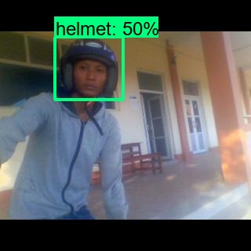
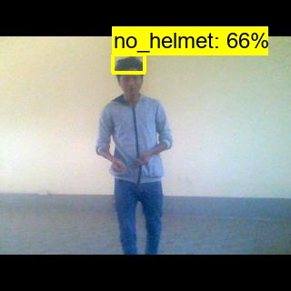
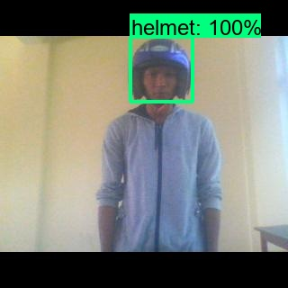
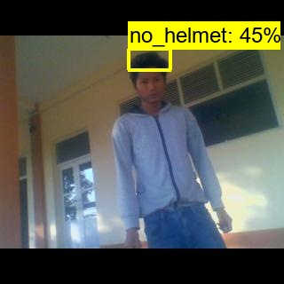

#  Helmet Detection using TensorFlow Object Detection API

This project aims to detect whether a person is wearing a helmet or not using a real-time object detection model built with TensorFlow's Object Detection API. The model is trained on a **custom dataset** annotated manually using **LabelImg**, and deployed for both image and webcam inference.

---


## Features

-  Real-time detection using webcam
-  Lightweight SSD MobileNetV2 architecture
-  Pascal VOC-style annotation support
-  TFRecord-based data pipeline
-  Modular training, inference, and evaluation scripts
-  Visual output with bounding boxes and labels

---


## Project Structure

```HelmetDetectionProject/
├── helmet_detector/
│   ├── config/
│   │   └── config.py
│   ├── data/
│   │   ├── loader.py
│   │   ├── raw/
│   │   │   ├── train/
│   │   │   │   ├── images/
│   │   │   │   └── annotations/
│   │   │   ├── val/
│   │   │   │   ├── images/
│   │   │   │   └── annotations/
│   │   │   └── label_map.pbtxt
│   │   └── processed/
│   │       ├── train/
│   │       │   ├── images/
│   │       │   └── annotations/
│   │       ├── val/
│   │       │   ├── images/
│   │       │   └── annotations/
│   │       └── label_map.pbtxt
│   ├── models/
│   │   └── helmet_detection_ssd_mnet_v2/
│   │       ├── tf_model_zoo/
│   │       └── exportedModel/
│   ├── object_detection/
│   ├── scripts/
│   │   ├── preprocess.py
│   │   ├── generate_tfrecord.py
│   │   ├── train_model.py
│   │   ├── export_model.py
│   │   ├── infer_image.py
│   │   └── infer_webcam.py
│   └── test_output/
│       ├── test_images/
│       └── test_video/
├── README.md
├── requirements.txt
└── LICENSE
```


---


## Model

- Architecture: **SSD with MobileNet V2**
- Framework: **TensorFlow 2.x Object Detection API**
- Training: Fine-tuned using pre-trained weights from the TensorFlow Model Zoo
- Export Format: TensorFlow savedModel

---


## Dataset

- **Images**:
  - Training: `572`
  - Validation: `236`
- **Annotations**: Collected using [LabelImg](https://github.com/tzutalin/labelImg) in Pascal VOC (`.xml`) format

- **Classes**:
  - `Helmet`
  - `No-Helmet`

- **Preprocessing Steps**:
  - Converted VOC XML to CSV
  - Generated **TFRecord** files for training and validation

---


## Features

- Real-time webcam detection
- Single-image inference
- Modular script-based training and evaluation
- Export model to `SavedModel` format
- Post-inference testing with videos/images

---


## How to Run

### 1. Install dependencies
`git clone https://github.com/yourusername/HelmetDetectionProject.git
cd HelmetDetectionProjec
pip install -r requirements.txt
`

### 2. Preprocess and generate TFRecord
`python helmet_detector/scripts/preprocess.py`
`python helmet_detector/scripts/generate_tfrecord.py`

### 3. Train the model
`python helmet_detector/scripts/train_model.py`

### 4. Export trained model
`python helmet_detector/scripts/export_model.py`

### 5. Run inference

- **On a single image**
`python helmet_detector/scripts/infer_image.py --image_path path/to/image.jpg`

- **On webcam**
`python helmet_detector/scripts/infer_webcam.py`


### What I Learned
- Collecting and annotating a custom dataset using LabelImg
- Preprocessing VOC annotations into TFRecord format
- Training a custom object detector using TensorFlow’s Object Detection API
- Tuning the SSD MobileNetV2 pipeline config for performance
- Handling path resolution and training scripts across multiple directories
- Running inference via webcam and static images
- Optimizing training on limited hardware (batch size = 4, GTX 1050)


### Limitations
While the model demonstrates basic helmet detection capabilities, performance is currently limited due to:
- A relatively small and imbalanced dataset
- Lack of variation in lighting, angles, and backgrounds
- Simple, lightweight model architecture used (SSD MobilenetV2)
- Developed and trained entirely on a laptop (ASUS TUF FX505DD), with a batch size of 4 due to GPU limitations (NVIDIA GTX 1050).


### Future Improvements
- Add more data(better quality & under various conditions)
- Integrate stronger models(eg., YOLOv8, Efficient)
- Add Multi-class safety detection (helmet, vest, mask)
- Deploy as a web/mobile application for real-world scenario


## Sample Results
### Demo: Real-time Helmet Detection
<p align="center">
  
</p>

>  A short 5-second demo showing real-time helmet detection via webcam.

---

### Tensorboard Visualization
```bash
tensorboard --logdir=helmet_detector/models/helmet_detection_ssd_mnet_v2/logs
```

### Evaluate the model while training or after training
```
python helmet_detector/object_detection/model_main_tf2.py ^
  --model_dir=helmet_detector/models/helmet_detection_ssd_mnet_v2 ^
  --pipeline_config_path=helmet_detector/models/helmet_detection_ssd_mnet_v2/pipeline.config ^
  --checkpoint_dir=helmet_detector/models/helmet_detection_ssd_mnet_v2 ^
  --eval_timeout=0
```

### Detection on Test Images
Here are a few detection results on unseen images:

<p float="left">
  
  
  
  
  
</p>

> You can find the full output video at:  
> `helmet_detector/test_output/test_video/output_video.mp4`

## Acknowledgements

- [TensorFlow Object Detection API](https://github.com/tensorflow/models/tree/master/research/object_detection)
- [LabelImg](https://github.com/heartexlabs/labelImg) 


## Motivation
Helmet usage is crucial for safety in industrial, construction, and traffic environments. Manual enforcement is inefficient, and this project aims to provide a scalable, real-time solution using computer vision to improve compliance and reduce preventable injuries.

## License
This project is licensed under the [MIT License](./LICENSE).
